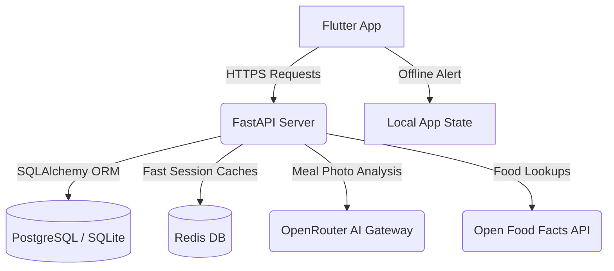

# NutriTrack 🍏

NutriTrack is a premium, end-to-end full-stack fitness and nutrition tracking platform (similar to MyFitnessPal). It features a visually stunning **Flutter** mobile frontend and a production-grade **FastAPI** backend, fully integrated and built to work seamlessly.

## 🚀 Key Features

*   **Smart Diary Logging**: Categorized meal logging (Breakfast, Lunch, Dinner, Snacks) and physical activities with swipe-to-delete.
*   **Deep Food Database**: Instant search powered by the Open Food Facts API, backed by a robust **Redis** cache layer.
*   **AI Meal & Photo Scan**: OCR and Vision analysis powered by **OpenRouter (Gemini 2.5 Flash)** to log entire meals from a photo.
*   **AI Voice Log**: Speech-to-text semantic parsing that logs items by parsing natural voice recordings (e.g. *"I had two bananas and a cup of whole milk"*).
*   **Water Tracker**: Premium fluid intake UI featuring smooth, interactive physics-based wave canvas animations.
*   **Weight Analytics & Regression**: Progression metrics with weight tracking logs and line-trend regression algorithms to map real weight shifts.
*   **Network Alerts & Reminders**: Native disconnection banner alerts and scheduled smart alarm reminders.
*   **Beautiful Obsidian Theme**: Modern glassmorphic dark mode styling with premium typography and micro-interactions.

---

## 📁 Monorepo Structure

```directory
nutritrack/
├── README.md                  # Monorepo setup guide & documentation
├── agent.md                   # AI agent instructions
├── backend/                   # FastAPI backend service
│   ├── app/                   # Core application code (models, routes, repositories)
│   ├── alembic/               # Database migration scripts
│   ├── tests/                 # pytest test suite
│   └── requirements.txt       # Python package dependencies
└── frontend/                  # Flutter mobile application
    ├── lib/
    │   ├── core/              # Theme, Router, Network Clients (Dio, interceptors)
    │   └── features/          # Feature domains: auth, dashboard, diary, progress, profile
    └── pubspec.yaml           # Flutter packages configuration
```

---

## 🛠️ Backend Setup & Run Guide

### Prerequisite Environment Variables
Before running the backend, create/configure your environment values. In the `backend/.env` file:

```env
# Database and Cache URL configuration
DATABASE_URL=sqlite+aiosqlite:///./nutritrack.db
REDIS_URL=redis://localhost:6379/0

# Security Configuration
SECRET_KEY=94bcde832b4b4554b7ae28d484ea388ba72ef2cfce71a0b3b4bc8fa77a2efde5
ALGORITHM=HS256
ACCESS_TOKEN_EXPIRE_MINUTES=60

# OpenRouter Free LLM Gateway
OPENROUTER_API_KEY=your-openrouter-key-here
OPENROUTER_MODEL=google/gemini-2.5-flash:free 

# Image Hosting Services (OCR Meal Scanning)
CLOUDINARY_CLOUD_NAME=your-cloud-name
CLOUDINARY_API_KEY=your-api-key
CLOUDINARY_API_SECRET=your-api-secret
```

### Option A: Local Development Run (Fastest)

1.  **Navigate to the Backend Directory**:
    ```powershell
    cd backend
    ```
2.  **Create and Activate a Virtual Environment**:
    ```powershell
    python -m venv .venv
    .venv\Scripts\Activate.ps1   # Windows PowerShell
    # or: source .venv/bin/activate (macOS/Linux)
    ```
3.  **Install Dependencies**:
    ```powershell
    pip install -r requirements.txt
    ```
4.  **Run Database Migrations**:
    ```powershell
    alembic upgrade head
    ```
5.  **Seed Default Exercises**:
    The backend automatically seeds 50+ workouts and exercises on startup!
6.  **Run the Server**:
    ```powershell
    uvicorn app.main:app --reload --host 0.0.0.0 --port 8000
    ```
    Access the OpenAPI interactive docs at: [http://localhost:8000/docs](http://localhost:8000/docs)

---

## 📱 Frontend Setup & Run Guide

The Flutter frontend is engineered to work flawlessly on both iOS and Android. It uses a custom **Dio** network client with automatic auth token injection.

### Prerequisites

*   Flutter SDK (v3.44.0 or matching stable version)
*   Dart SDK (v3.12.0+)
*   An Android Emulator or physical test device.

> [!IMPORTANT]
> The Android Emulator routes local computer servers through `10.0.2.2`. The Dio client is pre-configured to automatically map requests to `10.0.2.2:8000` when running in the emulator.

### Running the App

1.  **Navigate to the Frontend Directory**:
    ```powershell
    cd frontend
    ```
2.  **Install Flutter Packages**:
    ```powershell
    flutter pub get
    ```
3.  **Run Code Analyzers**:
    Ensure the code compiles error-free:
    ```powershell
    flutter analyze
    ```
4.  **Start the Application**:
    Ensure your emulator/simulator is booted or your test device is plugged in, then run:
    ```powershell
    flutter run
    ```

---

## 🧪 Running Backend Unit Tests

A comprehensive suite of API and logical tests is provided. Run them with:

```bash
cd backend
pytest
```

---

## 🌟 Premium Architecture Details



### 1. Unified AI Agent (OpenRouter API)
We integrate with OpenRouter's free tier to execute heavy AI parsing without any cost bounds. The backend passes user food voice recordings and meal logs to `google/gemini-2.5-flash:free` via structured system prompts that output strictly formatted JSON responses, guaranteeing error-free updates back to the client database.

### 2. Open Food Facts API & Caching
To prevent slow network request times, barcode matches and search results fetched from the Open Food Facts API are cached in Redis. Food item cache TTL is set to 24 hours, and barcodes are cached for 7 days, giving users instant results.
